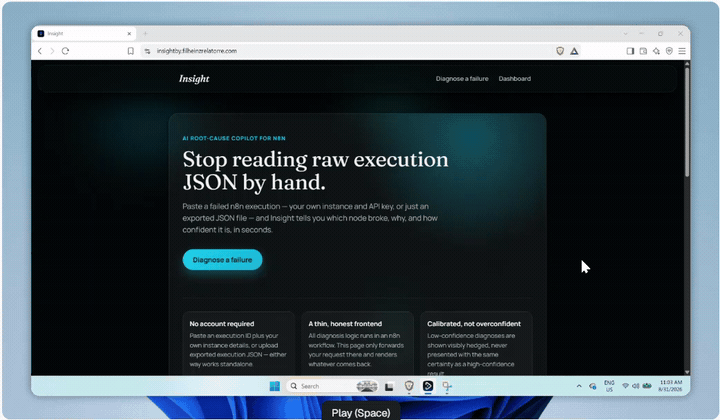

# Insight

An AI root-cause copilot for n8n workflow failures. Paste a failed execution - or connect an n8n instance for ongoing monitoring - and get a plain-English diagnosis of which node broke, why, and a suggested fix, instead of reading raw execution JSON by hand.

[](https://insightby.filheinzrelatorre.com)


<br>

<p align="center"></p>

Try it with no signup required at `/diagnose`. Full product spec, architecture rationale, and eval plan: [PRD.md](PRD.md).

## How it works

Insight is two pieces working together:

1. **Frontend** ([`frontend/`](frontend/)) - a Next.js app that's a thin, mostly stateless client. The public `/diagnose` page and the authenticated `/dashboard` (connect an instance, add workflows to monitor, browse diagnosis history) never run any diagnosis logic themselves; they either forward a request to the n8n backend or read already-diagnosed rows straight from Postgres.
2. **n8n backend** (self-hosted, not in this repo) - a single workflow handling three entry points: the public diagnose webhook, a per-instance push-ingest webhook (fired by a small Error Trigger piece Insight installs automatically on a monitored workflow - see "Connecting your own n8n instance" below), and instance connect/revoke/list-workflows/add-workflow. The pipeline: fetch the failed execution → redact secrets before it ever reaches an LLM → embed the error text and retrieve similar known patterns from a knowledge base → prompt an LLM (Groq) for a structured diagnosis → store it and alert Slack if confidence clears the threshold.

```
n8n (your monitored workflows)
   │  Error Trigger fires on failure
   ▼
n8n (Insight's backend workflow)
   │  fetch execution → redact → retrieve → diagnose (LLM)
   ▼
Postgres (Neon)  ────▶  Next.js dashboard (this repo's frontend/)
   │
   ▼
Slack alert (connected-instance mode only)
```

**Note on the connection above:** the frontend's own code only ever reads `connected_instances`/`diagnoses` (n8n is the sole writer to those two tables) - but this build uses one Postgres connection string for that *and* for Auth.js's own user/session tables, which genuinely need write access, rather than two separate roles. See `frontend/.env.example` and `frontend/src/lib/db.ts` for the full reasoning; PRD.md documents this as a known simplification, not an oversight.

**Current status:** the diagnosis pipeline, public diagnose page, connected-instance dashboard, and Slack alerting are live and working end-to-end. Knowledge-base retrieval (the RAG half of the pipeline) is built but currently disabled pending a seeded Qdrant collection - the LLM diagnoses from the raw error and execution context alone in the meantime. This is called out because the PRD's headline evaluation metric is the accuracy delta *with* retrieval turned on, which is still pending real seed data.

## Repo layout

| Path | What it is |
|---|---|
| [`frontend/`](frontend/) | The Next.js app - see [`frontend/README.md`](frontend/README.md) for local setup. |
| [`workflows/`](workflows/) | Two files a real user imports into *their own* n8n instance to start monitoring it: an Error Trigger template that pushes failures to Insight, and a workflow that fails on command for testing the wiring. See [`workflows/README.md`](workflows/README.md). |
| [`migrations/`](migrations/) | SQL run once against the Postgres database this app and the n8n backend share: Auth.js's own tables, plus `connected_instances` / `diagnoses`. |
| [`PRD.md`](PRD.md) | The full product spec this was built from - problem statement, architecture decisions and why, security model, evaluation plan, and what's deliberately out of scope for v1 (e.g. auto-applying a suggested fix - see PRD §2.2 and §11). |

## Running the frontend locally

```bash
cd frontend
npm install
cp .env.example .env.local   # see the file itself for what each variable does
npm run dev                  # http://localhost:3000
```

The frontend alone is enough to browse the UI, but real diagnosis requests need the n8n backend and Postgres database it depends on - `frontend/.env.example` documents every variable and where its value has to match on the n8n side.

## Connecting your own n8n instance

To get diagnoses on your own workflow failures rather than just the public paste-and-diagnose page:

1. Sign in at `/dashboard` and connect your instance (base URL + an n8n API key).
2. Insight lists every workflow on that instance and flags which ones aren't monitored yet.
3. Click **+ Add workflow** on the one you want protected. Insight creates and activates its own error-workflow template on your instance and points that workflow's **Error Workflow** setting at it - automatically, no manual n8n editing.

This is a deliberate, disclosed change to Insight's trust model: as of the "Add workflow" feature, the API key you provide is used for a few narrowly-scoped **write** calls into your instance (create/activate Insight's own template, update one workflow's Error Workflow setting only - never that workflow's own nodes or logic), not just reads. See [PRD.md §5](PRD.md) for the exact endpoint allowlist. A manual fallback (import the template yourself, no write access needed) is still documented in [`workflows/README.md`](workflows/README.md).

## Changelog

- **2026-08-12** - Security audit fixes: closed an SSRF gap where a user-supplied n8n instance URL was only syntax-checked, not restricted (now HTTPS-only, no localhost/internal hostnames/bare IPs); the two new "Add workflow" API routes no longer relay raw upstream/database error text to the browser; enabled Postgres TLS certificate verification (was `rejectUnauthorized: false`); added format validation for instance/workflow ids; added a per-user rate limit and a client-side single-flight guard plus an atomic conditional update in n8n to prevent concurrent "Add workflow" clicks from creating duplicate templates; the public diagnose page's visitor-supplied API key is now cleared from state right after use; added an optional `AUTH_ALLOWED_EMAILS` sign-in allowlist (was previously proposed in the PRD but never implemented); upgraded Next.js to 16.3.0 and resolved all `npm audit` findings; added baseline security headers (CSP, X-Frame-Options, Referrer-Policy).
- **2026-08-12** - Added the "Add workflow" auto-install feature described above - the biggest change to Insight's trust model since launch, see PRD.md §5/§6.6a for the full write-endpoint allowlist this introduced.
- **2026-07-29** - Added retry handling (3 tries, backoff) to the execution-fetch, API-key-validation, and Postgres write steps in the n8n backend, none of which previously had any resilience against transient failures.
- **2026-07-29** - Replaced plaintext storage of the per-instance ingest token and connected n8n API key with real cryptography: the ingest token is now SHA-256 hashed before storage/comparison, and the API key is AES-256-GCM encrypted at rest and only decrypted in-memory when it's actually needed to call the customer's instance. **Operational follow-up:** this requires an `INSIGHT_ENCRYPTION_KEY` environment variable set on the n8n instance; existing rows should be re-hashed/re-encrypted once it's set, since the encryption step will otherwise throw.
- **2026-07-29** - Cleanly isolated the disabled knowledge-base retrieval scaffold (Qdrant search, reranker, embedding nodes) so it's a fully disconnected island with no live path in or out, instead of sitting silently upstream of an enabled node. Fixed a placeholder value left in the (disabled) reranker's URL and a malformed (disabled) Qdrant search URL, and clarified the workflow's own documentation that this is scaffolding for future RAG integration, not an active feature - see "Current status" above.

---

## About the developer

**Fil Heinz O. Re La Torre** - Automation & AI Solutions Engineer, building integrations and AI-backed workflows that go from idea to production in days.

[](https://www.filheinzrelatorre.com)
[](https://ph.linkedin.com/in/filheinzrelatorre)
[](https://github.com/jabluetooth)
[](mailto:filheinz27@gmail.com)

**Other projects:** [Match](https://github.com/jabluetooth/match) · [ZeroPress](https://github.com/jabluetooth/zeropress) · [Mimo](https://github.com/jabluetooth/mimo) · [Se7en](https://github.com/jabluetooth/se7en) · [see all →](https://github.com/jabluetooth)

## License

MIT - see [LICENSE](LICENSE)
